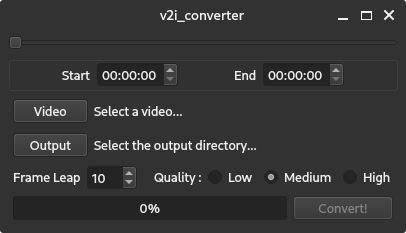

# Video to Image Converter
Welcome to Video to Image Converter (such a generic name i know). With this program, you can convert a video to frames as many as you like!
No more screenshot spamming the video!

## Screenshot


## Dependencies
- python 3.10
- PyQt6
- ffmpeg-python

## Usage
```
git clone https://github.com/petorikooru/v2i_conterter
cd ./v2i_converter/src

pip install -r requirement.txt
pyuic6 form.ui -o ui_form.py
python main.py
```

## Instruction
- Frame Leap
Basically skip frame for every frame rate of that video
> eg : 60 fps video + 10 frames leap = 6 frames extracted

## Credits
- LTI Team
- qt
- ffmpeg-python
