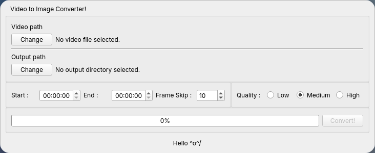

# Video to Image Converter
Welcome to Video to Image Converter (such a generic name i know). With this program, you can convert a video to frames as many as you like!
No more screenshot spamming the video!

## Screenshot


## Dependencies
- python 3.10
- PySide6
- ffmpeg-python

## Usage
```
git clone https://github.com/kingofaris/Tutorial-Git
cd Tutorial-Git/Raditya

pip install -r requirement.txt
pyside6-uic form.ui -o ui_form.py
python main.py
```

## Instruction
1. Select the video you want to convert to images.
2. Select directory you want to save the extracted video's frames.
3. Input the timestamp of the video's starting point you want to convert. (The default is 00:00:00)
4. Input the timestamp of the video's ending point you want to convert. (The default is the end of the video's timestamp)
5. Input how many frame skip of the conversion you want to perform. (The default is 10)
> e.g. :\
> A video has 60 frames in total, if you apply frame skip value of 10, it will extract only 1 frame for each 10 frame.\
> In total, only 6 frames will be extracted from that video.

6. Set the frame's quality you want (lower quality means lower disk usage) (The default is Medium)
7. Convert!

## Credits
- LTI Team
- QT
- ffmpeg-python
- ChatGPT (i love chatgpt, such a godsend creation)
